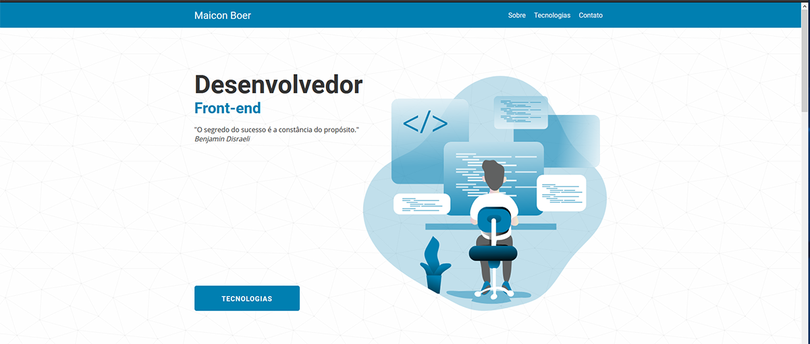

# Portfólio - Maicon Boer 

Bem vindo ao meu portfólio (projetos serão adicionados em breve ao mesmo).

https://maiconboer.github.io/

--------------------------------------------------------------

--------------------------------------------------------------

Sou graduado em Análise e Desenvolvimento de Sistemas, atualmente moro em  
Joinville-SC, possuo 10 anos experiência em tecnologia, voltado à Hardware,  
mas minha paixão sempre foi desenvolvimento web, após minha graduação, estou  
realizando esta transição para o mundo Front-end, estudando incansavelmente,  
o que está superando todas as minhas expectativas.  

Sou fanático por desafios e extremamente motivado a aprender novas tecnologias,   
mas não pulo etapas, para partir para uma nova tecnologia, necessito ter um  
excelente entendimento da atual.  

Em meu workflow, utilizo:

- HTML5
-    CSS3
-    SASS
-    JAVASCRIPT
-    NODE.js (cursando)
-    NPM
-    NUNJUCKS
-    GULP
-    GIT

No momento estou no GoStack da Rocketseat , um treinamento online, prático e intensivo, no formato de bootcamp, para me especializar como um fullstack, stack do curso:

 -   NODE.js
 -   REACTJS
 -   REACT-NATIVE

Confira meu portfólio, ficarei muito feliz em receber alguma sugestão ou crítica  
sobre o código do mesmo, o mesmo sofre atualizações constantes, sempre que algo novo  
(tecnologia/boas práticas e etc) é absorvido, se fizer sentido colocar em um 
exemplo de portfólio simples como este, será implementado.
